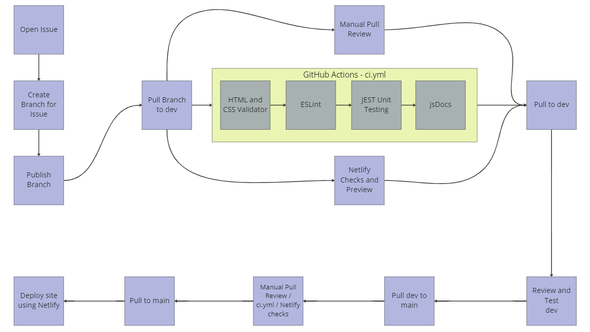

# Phase 1 Pipeline Status

website url: [https://cs-dictionary.netlify.app/](https://cs-dictionary.netlify.app/)

## Functional

Our group is using issues, branches, and pull requests in this phase. On the pull request, there are GitHub Actions checks, Netlify checks, and a manual review before the branch is pulled to dev. Our HTML and CSS validators, ESLint check, JEST Unit tests, and JSDocs are functional. After testing dev, we can pull request dev to main, which goes through more manual, Actions, and Netlify checks. After pulling to main, the site is deployed via Netlify.

### HTML Validator

The HTML validator action checks for error in HTML and CSS files in a specified directory. In our pipeline, we specified the directory to the source folder, which is where all of our HTML and CSS would be located. The action runs on a push or pull request to the main, dev, or other specified branches.

### ESLint

The ESLint check action uses Node.js. After checking out the repository, it installs Node dependencies and we are able to choose from a set of linters to run. For now, we are only running ESLint. There are multiple styles to choose from, and we have chosen the Airbnb style because it is popular and nobody has any strong opinion in this case. The lint check also notes which files and lines errors occur on for javascript formatting.

### JEST Unit Tests

The Unit Test action uses JEST to run `.test.js` files for unit testing. It gives feedback on number of tests run, number of failures, etc.

### JSDocs

JSDocs will find `.js` files in the repo and create documentation for it based on the parameters, headers, and return values of the function.

### Netlify

Netlify is used as our deployment platform, after exploring others like Firebase and Heroku, we decided on Netlify for its free features and ease of use. Using Netlify, we are able to create production deploys or have temporary previews for pull requests which are all automatically integrated into GitHub so on a push or pull to dev or main, Netlify will automatically run checks and deploy.

## In Progress

Though our automated Unit tests and JSDoc are functional, we are still in the progress of writing complete tests and running the JSDoc action on working backend javascript files.
